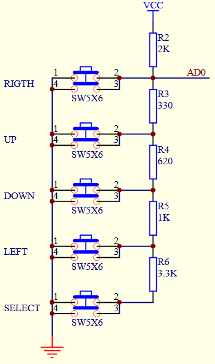

# Input variants #
## Using keys for input ##
If you want to connect keys to your display you can do it this way:

Use A6 or A7 instead of A0 for analog reading, witch are located on X6.
<pre>
// read the buttons
int read_LCD_buttons()
{
 adc_key_in = analogRead(0);      // read the value from the sensor 
 // my buttons when read are centered at these valies: 0, 144, 329, 504, 741
 // we add approx 50 to those values and check to see if we are close
 if (adc_key_in > 1000) return btnNONE; // We make this the 1st option for speed reasons since it will be the most likely result
 // For V1.1 us this threshold
 if (adc_key_in < 50)   return btnRIGHT;  
 if (adc_key_in < 250)  return btnUP; 
 if (adc_key_in < 450)  return btnDOWN; 
 if (adc_key_in < 650)  return btnLEFT; 
 if (adc_key_in < 850)  return btnSELECT;  

 return btnNONE;  // when all others fail, return this...
}
</pre>

## Using resistiv touch for input ##
Connector X6 has two analog inputs and can be used to read the signal from a resistive touchscreen.

Mode information here: 
http://ww1.microchip.com/downloads/en/AppNotes/doc8091.pdf 

and her: https://www.sparkfun.com/datasheets/LCD/HOW%20DOES%20IT%20WORK.pdf 